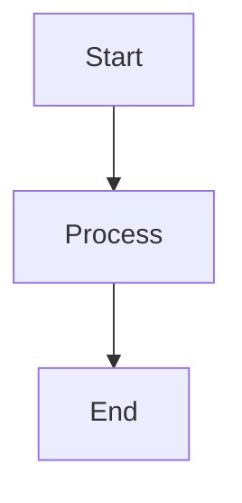
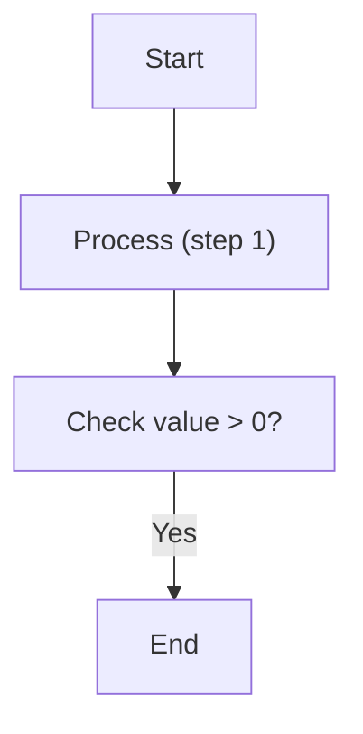
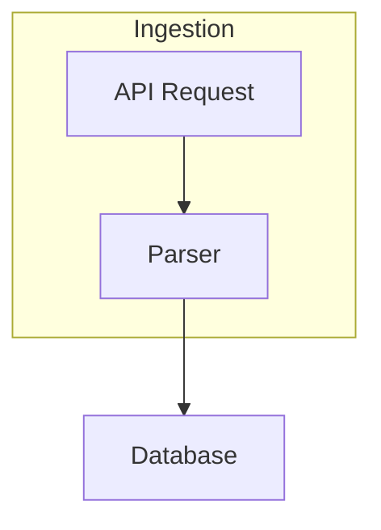
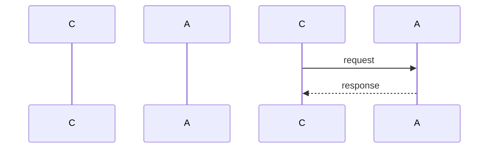
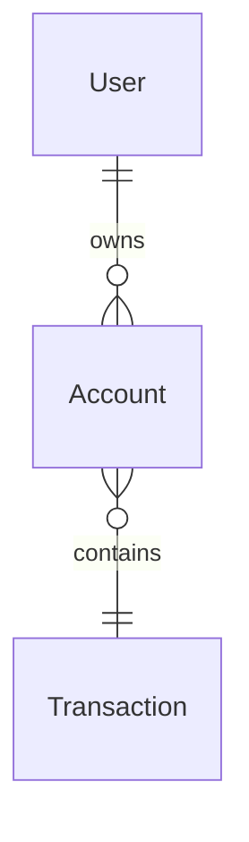
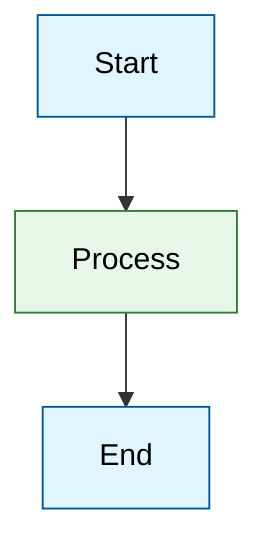
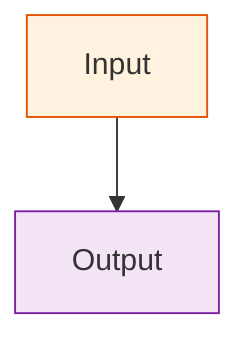

---
paths:
  - "**/*.md"
---


# Mermaid diagram best practices

Use this rule when creating or editing Mermaid diagrams in docs, READMEs, or PR descriptions. For full syntax, see [Mermaid docs](https://mermaid.js.org/intro/syntax-reference.html).

---

## Layout: Prefer vertical flowcharts (TD over LR)

- **Use `flowchart TD`** (top-down) by default so diagrams read top-to-bottom and fit narrow viewports and PR diffs.
- Use `flowchart LR` only when the flow is clearly horizontal (e.g. a short pipeline with many wide nodes).



---

## Labels: Always quote node text

- **Wrap all node labels in double quotes** so special characters (parentheses, colons, `#`, `>`, `<`, etc.) do not break the parser.
- Use `["Label text"]` for rectangles, `("Label text")` for stadiums, `{"Label text"}` for diamonds — and still put the text inside quotes inside the shape: `A["My label (optional)"]`.



- For `<` and `>` in labels, use HTML entities `&lt;` and `&gt;` inside the quoted string if the renderer misbehaves.
- **Avoid the bare word "end"** in a node — use `"End"` or `"Finish"` so the parser does not treat it as a keyword.

---

## Diagram types and when to use them

| Type | Use case | Example |
|------|----------|---------|
| **Flowchart** | Processes, workflows, decision trees | `flowchart TD` with `-->`, `---`, `-->|label|` |
| **Sequence** | Message flow between actors over time | `sequenceDiagram` with `participant`, `->`, `-->` |
| **Class** | OO structure: classes, attributes, methods | `classDiagram` with `class`, `+`/`-`/`#` |
| **State** | State machines, lifecycle states | `stateDiagram-v2` with `[*]`, `-->`, `state` |
| **ER** | Database schema, entities and relations | `erDiagram` with `ENTITY {}`, `||--o{` |
| **C4 Context** | High-level system/actor boundaries | `C4Context` with `Person`, `System`, `System_Ext` |

### Minimal examples (quoted labels; TD where applicable)

**Flowchart (TD):**


**Sequence:**


**Class:**
```mermaid
classDiagram
    class "MyService" {
        +handle()
        -config
    }
```

**State:**
```mermaid
stateDiagram-v2
    [*] --> "Idle"
    "Idle" --> "Running" : start
    "Running" --> "Idle" : stop
```

**ER:**


---

## Custom styling and colors

- **classDef:** Define a named style and apply it to nodes with `class nodeId classname` or `class nodeId1,nodeId2 classname`.



- **Inline style:** Use `style nodeId fill:#hex,stroke:#hex,color:#hex` for one-off styling.



- **Theme (init):** For document-wide defaults, use `%%{init: {'theme':'base', 'themeVariables': { 'primaryColor':'#e1f5fe', 'primaryBorderColor':'#01579b' } } }%%` at the top of the diagram (first line).

---

## Summary

1. **Prefer `flowchart TD`** over LR unless the diagram is clearly horizontal.
2. **Always use double quotes around label text** in nodes to avoid broken syntax.
3. Use **classDef** and **class** for reusable colors; **style** for one-off; **init** for theme.
4. Choose the diagram type that fits: flowchart (processes), sequence (interactions), class (structure), state (lifecycle), ER (schema), C4 (system context).
