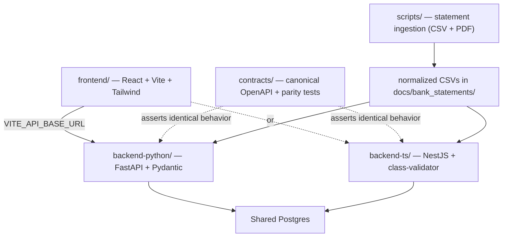

# CLAUDE.md

This file provides guidance to Claude Code (claude.ai/code) when working with code in this repository.

## Project

A **local-first, single-user personal finance app**: budgeting, net-worth & investment tracking, transaction tracking, and debt/goal planning. It ingests the owner's real bank/credit statements, normalizes them into one ledger, and serves budgeting/net-worth/planning views.

The owner's real financial data lives in the repo and is **gitignored** — read `.claude/rules/data-privacy.md` before touching anything under `docs/` or `images/`.

## The defining idea: two parallel backends at 1:1 parity

There is **one frontend and two backends**, and the two backends are kept at **strict 1:1 feature/API parity**. Each feature is built twice — once in Python/FastAPI, once in TypeScript/NestJS — as a deliberate exercise to learn TS backends by direct comparison with FastAPI.



**RULE #1 — Backend parity (`.claude/rules/backend-parity.md`):** every route, request/response schema, validation rule, error shape, and HTTP status code must be identical across both backends, changed in the **same branch**, with `contracts/` parity tests updated. Do not let the backends drift. When unsure, run the **`parity-auditor`** skill.

| FastAPI (Python) | NestJS (TypeScript) |
|---|---|
| `APIRouter` / Pydantic v2 / `Depends` | Module+Controller / DTO+class-validator / DI provider |
| SQLAlchemy 2.0 + Alembic (**canonical migrations**) | TypeORM, `synchronize:false` (**mirrors** the schema) |
| `/openapi.json` | `@nestjs/swagger` |

## Repository layout

| Path | What it is |
|------|-----------|
| `frontend/` | React + Vite + Tailwind (TS). Backend-neutral; selects a backend via `VITE_API_BASE_URL`. |
| `backend-python/` | FastAPI service (uv project, package `app`). SQLAlchemy + Alembic. |
| `backend-ts/` | NestJS service (npm). TypeORM + class-validator. Parity twin of `backend-python/`. |
| `contracts/` | Canonical OpenAPI spec + cross-backend parity/contract tests. |
| `scripts/` | Repo-level data-prep utilities (e.g. `extract_chase_statements.py`) — parse raw statements into normalized CSVs. Root uv project. |
| `tests/` | Tests for `scripts/` (root uv project; `conftest.py` puts `scripts/` on the path). |
| `docs/` | Committed markdown docs **and** gitignored real data (`bank_statements/`, `gemini_investments_conversation/`). `docs/STRUCTURE.md` is the canonical layout. |
| `images/` | Gitignored financial screenshots. |
| `config/` | `accounts.example.yaml` (committed template) + `accounts.yaml` (gitignored, real balances). |
| `plans/` | `agent_checklist.md` (task SSOT), `first_pass_high_level_plan.md`, `checklist_flow.md`. |
| `pull_requests/` | PR description docs (`<slug>.md`). |
| `.claude/rules/` | The rule library (`*.md`). Path-scoped rules use `paths:` frontmatter (lazy-load on matching files); always-on rules (parity, privacy, branching) omit it. |
| `.claude/skills/` | The skill library (workflow + diagnostics). |
| `docker-compose.yml` | Shared Postgres. |

## Two Python projects (intentional)

- **Root `pyproject.toml`** (`personal-finance-ingest`) — data-prep utilities in `scripts/` + their `tests/`. Run from repo root: `uv run python scripts/extract_chase_statements.py`, `uv run pytest`.
- **`backend-python/pyproject.toml`** (`personal-finance-api`) — the FastAPI service. Run from `backend-python/`.

These are separate uv environments. Ingestion produces normalized CSVs; the backends consume them.

## Common commands

```bash
# Shared database
docker compose up -d                       # Postgres

# Backend (Python / FastAPI) — from backend-python/
uv sync
uv run alembic upgrade head
uv run uvicorn app.main:app --reload       # http://localhost:8000

# Backend (TypeScript / NestJS) — from backend-ts/
npm install
npm run start:dev                          # http://localhost:3000

# Frontend — from frontend/
npm install
npm run dev                                # http://localhost:5173

# Statement ingestion — from repo root
uv run python scripts/extract_chase_statements.py
```

### Quality gates (≥ 80% coverage each — do not merge red or with parity drift)

```bash
# backend-python/
uv run ruff check . && uv run ruff format --check . && \
  uv run pytest --cov=app --cov-report=term-missing:skip-covered --cov-branch --cov-fail-under=80

# backend-ts/
npm run lint && npm run format:check && npm run test:cov

# frontend/
npm run lint && npm run test -- --coverage

# contracts/  (parity — runs against BOTH backends)
npm run test:parity

# repo root  (ingestion scripts)
uv run pytest
# single test:  uv run pytest tests/test_extract_chase_statements.py -q
```

## Conventions

- **Branching** (`.claude/rules/branching.md`): `{yyyy}-{mm}-{dd}-<TYPE>/<feature-slug>`, TYPE ∈ {FE, BE-PY, BE-TS, BE, DB, DOCS, DEPLOY, INFRA}. Use **BE** (both backends, one branch) for any API/behavior change to preserve parity. One feature per branch; merge to `main` only after gates + parity pass.
- **TDD**: red → green → refactor; tests assert behavior/contracts, ≥ 80% coverage. See `testing_python.md`, `testing_typescript.md`, `testing_frontend.md`.
- **Docs**: new docs get a `YYYY-MM-DD` filename prefix; maintain a top CHANGELOG on updates. Update README + `docs/STRUCTURE.md` on merge (`structure-on-merge.md`).
- **Ingestion** (`api-data-pulls.md`): normalize every source onto one signed-amount convention (negative = money out); validate against an invariant (e.g. parsed purchases == the statement's printed total); `Decimal` money; idempotent re-import.
- **MCP**: **Context7** for library docs before assuming APIs; **Perplexity** for research (no secrets in queries).

## Rule & skill index

**Rules** (`.claude/rules/`): `backend-parity` (Rule #1) · `data-privacy` · `python` · `typescript` · `testing_python` · `testing_typescript` · `testing_frontend` · `frontend_tailwind` · `web_design_best_practices` · `api-data-pulls` · `branching` · `structure-on-merge` · `pull-requests` · `mermaid`.

**Skills** (`.claude/skills/`): `checklist-phase-runner` · `checklist-phase-runner-parallel` · `branch-finalization` · `parity-auditor` · `bug-hunter` · `devils-advocate`.

## Current status (2026-05-24)

Foundation stage. In place: repo skeleton, both backend project configs, the rule + skill libraries, and a working Chase PDF statement extractor (`scripts/extract_chase_statements.py`, 31 passing tests). **Not yet built:** the FastAPI app, the NestJS app, the frontend, the Postgres schema/migrations, and the `contracts/` parity harness. Implementation is driven by `plans/agent_checklist.md`.
