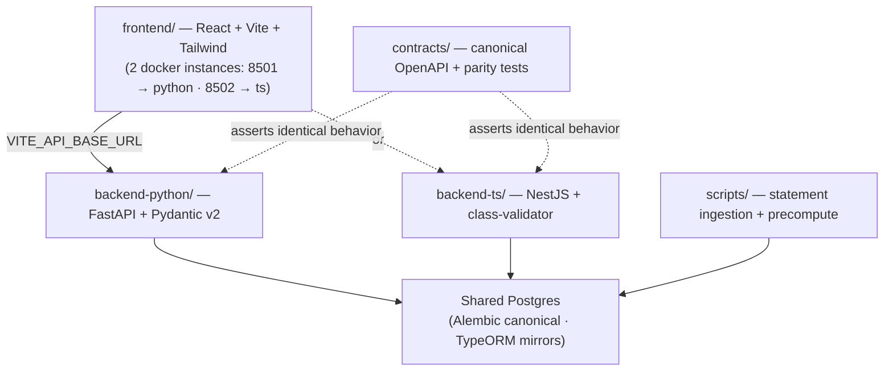

# Personal Finance

A **local-first, single-user personal finance app**: budgeting, net-worth & investment tracking, transaction tracking, and debt/goal planning. It ingests your own bank/credit statements, normalizes them into one ledger, and serves budgeting / net-worth / planning views to a single frontend.

> Your real financial data is **gitignored** and never committed (`.claude/rules/data-privacy.md`). Everything tracked here uses **synthetic** fixtures.

## The defining idea: one frontend, two backends at 1:1 parity

There is **one frontend and two backends** kept at **strict 1:1 feature/API parity** — each feature is built twice, once in **Python/FastAPI** and once in **TypeScript/NestJS**, as a deliberate exercise in learning TS backends by direct comparison with FastAPI. A `contracts/` harness proves they stay identical.



## Quickstart

```bash
# 1. Shared database
docker compose up -d                                   # Postgres on :5432

# 2. Python backend (FastAPI) — from backend-python/
uv sync && uv run alembic upgrade head && uv run uvicorn app.main:app --reload   # :8000

# 3. TypeScript backend (NestJS) — from backend-ts/
npm install && npm run start:dev                       # :3000

# 4. Frontend — from frontend/
npm install && npm run dev                             # :5173  (set VITE_API_BASE_URL to pick a backend)

# 5. Statement ingestion — from repo root
uv run python scripts/extract_chase_statements.py
```

Copy `.env.example` → `.env` (gitignored) and fill in `DATABASE_URL` and any connector keys.

## Repo map

| Path | What it is | README |
|------|------------|--------|
| [`frontend/`](frontend/README.md) | React + Vite + Tailwind; backend-neutral via `VITE_API_BASE_URL` | ✅ |
| [`backend-python/`](backend-python/README.md) | FastAPI service (uv, SQLAlchemy + Alembic — canonical schema) | ✅ |
| [`backend-ts/`](backend-ts/README.md) | NestJS service (npm, TypeORM mirrors schema) — parity twin | ✅ |
| [`contracts/`](contracts/README.md) | Canonical OpenAPI + cross-backend parity tests | ✅ |
| [`scripts/`](scripts/README.md) | Statement ingestion + precompute (root uv project) | ✅ |
| [`tests/`](tests/README.md) | Tests for `scripts/` (synthetic fixtures) | ✅ |
| [`docs/`](docs/README.md) | Committed markdown docs (+ gitignored real data) | ✅ |
| [`config/`](config/README.md) | `accounts.example.yaml` template (real `accounts.yaml` gitignored) | ✅ |
| [`plans/`](plans/README.md) | `agent_checklist.md` (task SSOT), `checklist_flow.md`, high-level plan | ✅ |
| `pencil/` | Pencil wireframes (`website_wire.pen`, synthetic) | — |
| `.claude/rules/`, `.claude/skills/` | Rule + skill libraries | — |

Canonical layout: [`docs/STRUCTURE.md`](docs/STRUCTURE.md). Roadmap: [`plans/agent_checklist.md`](plans/agent_checklist.md).

## Quality gates & contributing

`main` is protected — **PR-based merges only**, and all four CI checks must be green first:

| Gate | From | Command |
|------|------|---------|
| Python backend | `backend-python/` | `uv run ruff check . && uv run ruff format --check . && uv run pytest --cov=app --cov-fail-under=80` |
| TS backend | `backend-ts/` | `npm run lint && npm run format:check && npm run test:cov` |
| Frontend | `frontend/` | `npm run lint && npm run test -- --coverage && npm run build` |
| Parity | `contracts/` | `npm run test:parity` + clean OpenAPI diff |

Conventions: branches `{yyyy}-{mm}-{dd}-<TYPE>/<slug>` (`.claude/rules/branching.md`); any API/behavior change lands in **both** backends + `contracts/` in one branch (`backend-parity.md`, **Rule #1**); PRs follow `.claude/rules/pull-requests.md` (tiered description + happy-path verification + README upkeep). Never commit real financial data (`data-privacy.md`).
