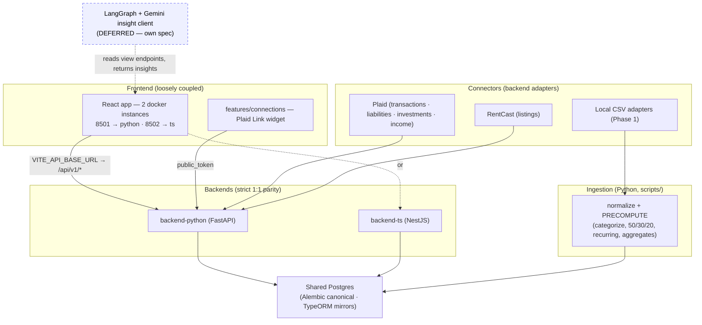
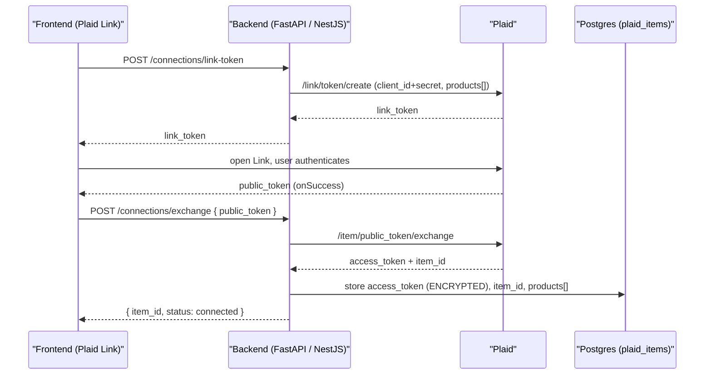
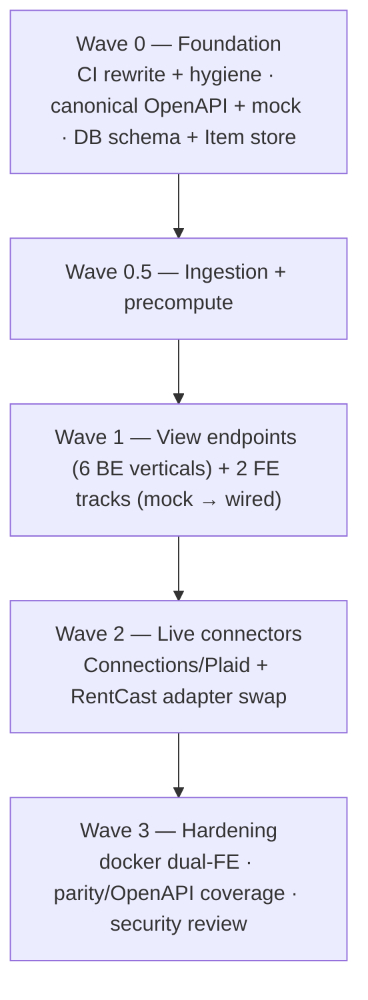

# Data Connectors & Frontend — Design Spec

> CHANGELOG
> - 2026-05-24: Initial spec. Backend-owned data connectors (Plaid-primary) behind a stable source/view contract; loosely-coupled frontend (7 screens) built against a mock; contract-first, 3-wave parallel execution. Analysis client deferred. — Connectors pass.
> - 2026-05-24 (§5, P3.1): The **DB-writing loader/precompute live in `backend-python/`** (`app/ingestion/`) so they run under the `python-backend` CI gate and reuse `app.models`/`app.db`; the raw→normalized-CSV **normalizers stay in `scripts/`**. P3.1 adds the idempotent loader (upsert on the DA-19 dedupe key). — Ingestion→DB pass.

## 1. Goal & scope

Turn the local-first finance app into a working **financial-insights portal** whose data sources can be flipped **per-source between a local flat file and a live API**, without changing the app contract. The frontend renders 7 screens (Story, Budget, Net Worth, Investments, Debt, Goals, Settings) and is **loosely coupled** to the backends via a frozen API contract + a mock.

**In scope:** the source/view API contract; the 5 source adapters (CSV now, Plaid/RentCast later); the precompute-at-ingestion pipeline; the 6 view endpoints; the 7 frontend screens; the Settings/Connections screen + Plaid Link; CI rewrite; the worktree/PR execution machinery.

**Deferred to its own spec:** the **LangGraph + Gemini Flash Lite analysis client** (the AI insight cards). The UI reserves space for insights but this plan does not build the agent.

**Out of scope (MVP):** hosting/Plaid Production, multi-user, mobile.

## 2. Architecture

**Loose coupling, precisely:** the frontend codes only to `/api/v1/*` and is developed/tested against a **Prism mock** generated from the canonical OpenAPI — it never needs a backend running, and it never knows whether a source's data came from a CSV or a live API. The *only* frontend↔provider coupling is the Plaid Link widget in `features/connections/`.

## 3. The two endpoint families

**(a) View endpoints** — what the screens render (served from precomputed/normalized tables). The frontend renders almost entirely from these.

| Screen | View endpoint | Key response fields (synthetic) |
|---|---|---|
| Budget | `GET /api/v1/budget?window=` | `savings_rate`, `effective_tax_rate`, `buckets[{name,target_pct,actual_pct,amount}]`, `categories[{name,amount,bucket}]`, `monthly[{month,needs,wants}]`, `recurring[{merchant,category,cadence,last_charged,monthly_est}]` |
| Transactions | `GET /api/v1/transactions?…` | paginated `items[{date,account,description,category,bucket,amount,is_recurring}]`, `page`, `total` |
| Net Worth | `GET /api/v1/networth?window=` | `net_worth`, `assets`, `liabilities`, `series[{month,retirement,investments,cash}]`, `accounts[{name,type,balance,delta_30d}]` |
| Investments | `GET /api/v1/investments` | `portfolio_value`, `unrealized_gain`, `allocation[{class,target_pct,actual_pct,amount}]`, `concentration[{holding,weight}]`, `holdings[{symbol,name,value,weight,gain}]` |
| Debt | `GET /api/v1/debt?strategy=` | `total`, `weighted_avg_rate`, `monthly_minimum`, `tranches[{rate,balance,loan_count,priority}]`, `payoff[{strategy,debt_free_year,total_interest}]`, `loans[…]` |
| Goals | `GET /api/v1/goals` | `target`, `saved`, `progress_pct`, `funding[{source,amount}]`, `affordability{price,down_payment,mortgage,monthly_piti,income_share}` |

**(b) Source endpoints** — the ingestion/adapter layer the **Settings screen** manages. Each has a stable contract; an adapter behind it is `local` (CSV/precomputed) or `api` (provider).

| Source endpoint | Phase-1 local file | Live provider | Auth |
|---|---|---|---|
| `/api/v1/sources/transactions` | `docs/bank_statements/*.csv` | Plaid (Transactions) | OAuth / Link |
| `/api/v1/sources/income` | `docs/paystubs/paystubs.csv` | Plaid Income | OAuth (premium) |
| `/api/v1/sources/holdings` | `docs/etrade_stocks_portfolio.csv` | Plaid Investments / E*TRADE | OAuth |
| `/api/v1/sources/loans` | `docs/loans.csv` (owner-provided) | Plaid Liabilities | OAuth |
| `/api/v1/sources/listings` | — (manual target) | RentCast | API key |

**(c) Connections endpoints** — Plaid Link lifecycle + Item management (drives the Settings "Connect" buttons):
`POST /api/v1/connections/link-token`, `POST /api/v1/connections/exchange`, `GET /api/v1/connections` (list Items + per-source mode/status), `POST /api/v1/connections/webhook`, and an OAuth redirect route.

## 4. Plaid integration model

One linked **Item** (one login) exposes multiple **products**, so Plaid backs four sources:

| Source endpoint | Plaid product |
|---|---|
| `/sources/transactions` | Transactions |
| `/sources/loans` | Liabilities (student loans) |
| `/sources/holdings` | Investments (verify E*TRADE coverage via `/institutions/search?products=investments`) |
| `/sources/income` | Income (premium) |

**Secrets live server-side only** (`PLAID_CLIENT_ID`, `PLAID_SECRET`, `PLAID_ENV`); `access_token` is encrypted at rest in `plaid_items`. Browser only ever holds the short-lived `link_token`/`public_token`.

**Environment strategy:** build + CI on **Sandbox** (free, fake, hermetic); owner validates real data on **Trial** locally with gitignored creds; **Production** (~$5–20/mo, individual approval not guaranteed) deferred. Plaid is a **swappable adapter** — **SimpleFIN** and direct-bank OAuth are documented fallbacks if Plaid cost/approval blocks. OAuth megabanks (Chase/BoA/Wells) need full Production + OAuth registration (Plaid owns the bank relationship; no per-bank registration for the developer).

## 5. Precompute-at-ingestion (parity-critical)

Deterministic analytics — categorization, transfer/recurring detection, 50/30/20 buckets, savings rate, monthly aggregates — run **once in the Python ingestion pipeline** (`scripts/`) and are written to aggregate tables in Postgres. **Both backends serve thin reads of those tables; neither recomputes.** This avoids reimplementing nontrivial logic in TypeScript and keeps parity trivial. *(This revises the original checklist P4.2, which had a categorization endpoint in both backends.)*

## 6. Security & privacy

- Secrets in a **gitignored `.env`** (+ `.env.example` placeholders); never committed, never in MCP queries.
- `access_token` **encrypted at rest**; an OAuth redirect endpoint registered in the Plaid dashboard.
- **CI is hermetic:** Plaid/RentCast calls are **mocked/recorded** (respx in Python, nock/MSW in TS) against **Sandbox** fixtures (fake data → safe to commit). No live calls or secrets in CI.
- All committed tests/fixtures use **synthetic** data (`.claude/rules/data-privacy.md`). Real-data validation is local-only and never recorded.

## 7. CI design

The current `.github/workflows/ci.yml` is Python-only, path-mismatched (`uvicorn app.main:app` + `pytest test/unit` at root), uses alpha `ty`, and is untracked. Replace with four gated jobs + a Postgres service, all required by branch protection before merge to `main`:

| Job | Working dir | Gate |
|---|---|---|
| python-backend | `backend-python/` | `ruff check` + `ruff format --check` + `pytest --cov --cov-fail-under=80` |
| ts-backend | `backend-ts/` | `npm run lint` + `format:check` + `test:cov` |
| frontend | `frontend/` | `lint` + `test --coverage` + `build` |
| parity | `contracts/` | boot both backends + `npm run test:parity` + OpenAPI diff |

## 8. Execution model — contract-first, vertical slicing, 3 waves

**Contract-first:** the canonical OpenAPI (view + source + connections) is authored and merged **first**, so every later branch *implements against* it and never edits it (each adds only its per-endpoint parity-test file → no contract-file conflicts). The frontend builds against a Prism mock of it.

**Vertical slicing:** a backend track = one endpoint in **both** backends + its parity test, in one `BE` branch. Frontend is **grouped** into two `FE` branches built against the mock.

**Waves** (git worktree per track, one PR per track, `--no-ff`, merge only on green + clean parity; driven by `checklist-phase-runner-parallel`):

**Phase-1 = local files falls out for free:** Wave 1 view/source endpoints ship on CSV/precomputed adapters; Plaid is a **Wave-2 adapter swap behind the same endpoints**.

**Per-track Definition of Done (acceptance criteria):**
- Contract honored (no edits to the frozen OpenAPI; response matches schema).
- TDD: tests written first; **≥80% coverage**.
- All four CI jobs green; for `BE` tracks the **parity gate** is clean (`parity-auditor` may be run).
- `FE` tracks: a Playwright/screenshot check of the screen against the mock.
- `connections`/Plaid track: a **security review** of token handling; CI uses mocked Plaid.
- Merged via `branch-finalization` (`--no-ff`, PR doc in `pull_requests/`).

## 9. Mapping to the checklist

Tasks live in `plans/agent_checklist.md` (phases revised this pass); staged parallel execution is in `plans/checklist_flow.md`. This spec is the contract/architecture reference those tasks point to.
